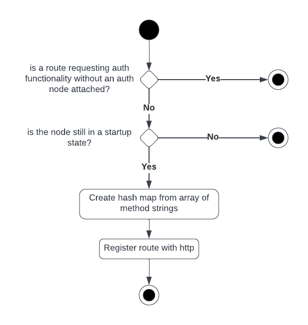
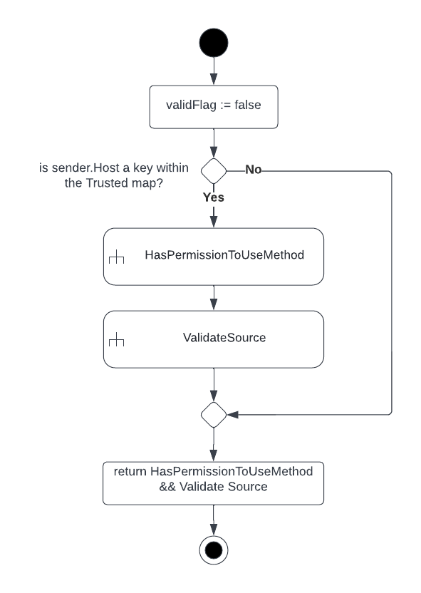
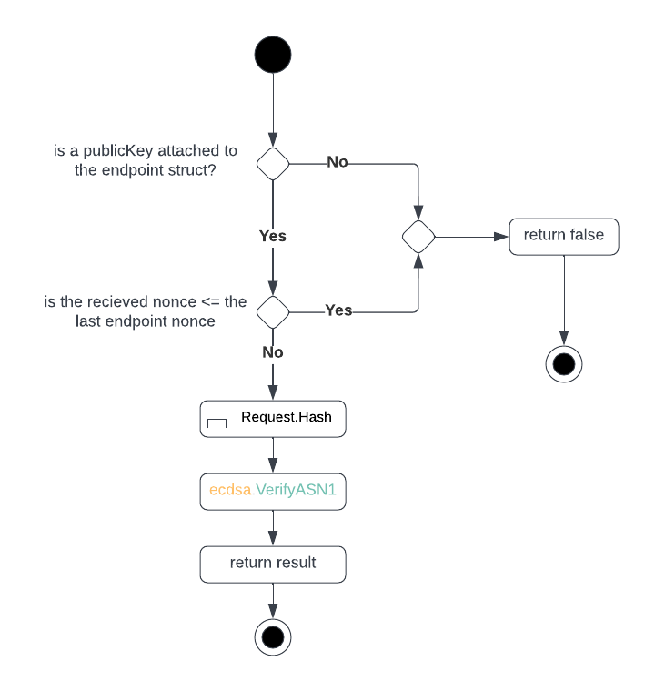
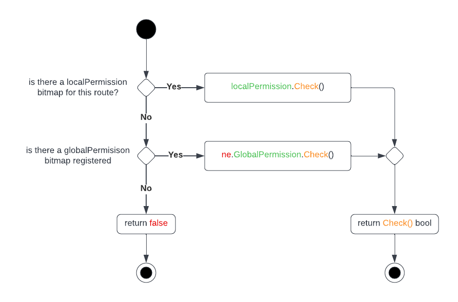
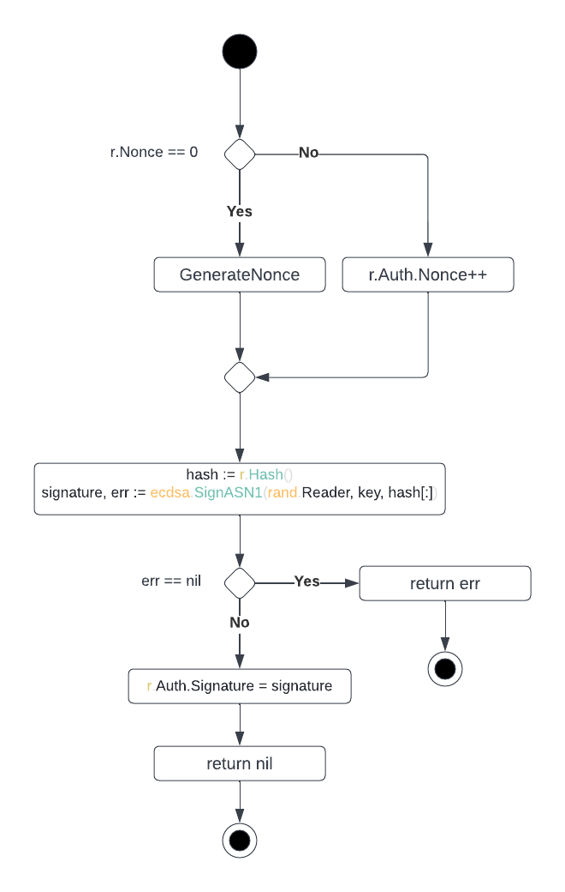
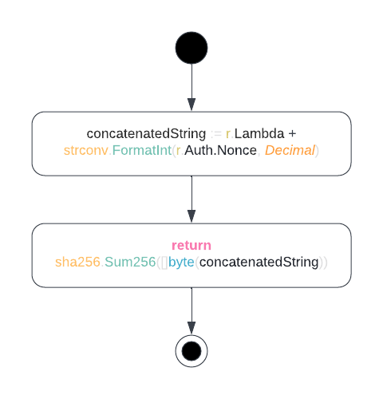

# F-ACK
## Fast Backend

### Net Package
Net is an extension of the go.http package designed for processing JSON formatted data in client-server architectures.
The package provides a native feel to designing remote callable functions for JSON data processing while handling low level networking and authentication logic needed for securing the remote code.

---

### Node
Node is responsible for registering new net.Function and handling low-level net.http functionality to communicate between
the client-server endpoints.

##### NewNode(address Address, optional ...any) *Node
Generates a new Node structure on the heap and returns a pointer to the object. The parameter "optional"
stores a variadic amount of optionals that can be passed to a Node structure.

**optional ...any**
1. Pointer to Auth
   If a valid auth pointer is passed to Node, routes can be registered with authentication enabled.

3. Boolean Debug Toggle

##### Status(status NodeStatus)
A thread safe function for modifying to Node state. Before changing the Node
state, an object mutex is locked to avoid a race condition when modifying NodeState.

##### Name(name string)
A safer way to modifying the Node name given during Startup. A node name should be static during runtime given that during a time interval from (0 to inf)
if N logs are stored, using the node name as an id, then a dynamic name change at time t
would render new logs created from (t to inf) detached from logs created from (0 to t)

##### Function(path string, handler Router) *Route
Registers a new route to handle HTTP GET, POST, PULL, and DELETE requests related to JSON encoded requests.

##### Registering a New Function


##### The Function Wrapper


##### Start()
Switches the Node into a Running state and starts the HTTP server.

##### String() string
Returns a JSON marshaled version of the Node.

---

### Auth
Auth is a key-value database that holds Endpoint records used to authenticate the permissions of a net.Request's
sender.

##### NewAuth() *Auth
Generates a new Auth struct on the heap and returns a pointer to the struct memory.

##### AddTrusted(ip string, ne *Endpoint) bool
Associates a client ip address with a net.Endpoint structure (record). This function is **thread safe** by using a mutex to guarantee single-thread
access to modifying the net.Endpoint database, avoiding possible race conditions associated with dynamic allocation of two requests to add the
dame key->Endpoint structure.

##### RemoveTrusted(ip string)
A thread safe function to delete an ip->net.Endpoint record from the database -- the mutex will block any functions that attempt to manipulate
the state of the key-value database including AddTrusted. When deleting an ip key from the database, we want to block AddTrusted in case we are
trying to do-so in order to update the value of a key (note, we cannot call AddTrusted on a pre-existing key to swap the net.Endpoint value so we must delete it first).

##### IsEndpointAuthorized(sender *Address, request *Request, path, method string) bool
Why not pass the lambda provided by the request to IsEndpointAuthorized?
- the user is not forced to use the request.Send() method and can
  direct the request to an url they do not have permission for while
  inserting an url path as the lambda for a route they do have permission  for

Why not place method into request type as well?
- a lambda can support > 1 HTTP method
- it is safer to use a server-defined method that the node has control over



---

### Endpoint
Endpoint is an abstraction of a client that wishes to access the net.Function route of a net.Node. Functions related to
ECDSA signature verification, net.Function route method local/global permission access, and JSON encoding.

##### NewEndpoint(name string, publicKey *ecdsa.PublicKey) *Endpoint
Generates a new Endpoint struct on the heap and returns a pointer to the struct memory. The **{name}** string parameter is a unique
identifier of the Endpoint struct such as a host url. The **publicKey** parameter is required to validate the signature
received in a net.Request that matches with the unique identifier given to this net.Endpoint.

##### AddGlobalPermission(permission *Permission)
Global permission is a net.Permission bitmap that authorizes access to net.Function routes if a functions LocalPermission bitmap
does not exist. In the event that the GlobalPermission bitmap is missing, the LocalPermission bitmap takes priority.

##### AddLocalPermission(route string, permission *Permission)
Local permission is a net.Permission bitmap unique to a net.Function's unique route. If a local permission bitmap exists,
it takes priority over the Global Permission bitmap associated with the net.Endpoint. If the local permission bitmap does not
exist, the global permission bitmap takes priority.

##### GeneratePublicKey(data []byte)
Generates a new ecdsa.PublicKey based on the **data** parameter on the heap and assigns the memory address to the Endpoint.PublicKey field.

##### PublicKeyToBytes() []byte
Returns a byte array representation of the ecdsa.PublicKey owned by the Endpoint.PublicKey field. This function should be used
when dynamically registering new PublicKeys on remote Nodes.

##### ValidateSource(request *Request) bool
Returns true if the ECDSA generated signature found in the **request.Auth.Signature** matches the ecdsa.Public key found in
the Endpoint.PublicKey field.



##### HasPermissionToUseMethod(route, method string)
Given a net.Function route, the function evaluates whether the *global* or *local* permission bitmaps give the destination access
to the server-specified HTTP method.

**[!] Note** if no *global* or *local* permission bitmap is associated with the net.Endpoint, then HasPermissionToUseMethod will
always evaluate to false.



##### String() string
Returns a JSON representation of the Auth structure.

---

### Address
A structure used to enclose the **ip** *(url)* and **host** of a Node endpoint. The advantage of using the Address abstraction
is to avoid needing to manipulate the string representation of an endpoint "127.0.0.1:8000" to abstract this information.

##### NewAddress(ip string) (*Address, error)
Generates a new Address structure on the heap and returns a pointer to the struct in memory. The **{ip}** string parameter must be
in the format of "{url}:{port}" or an error will be returned.

##### String() string
Returns a formatted representation of the **Address.Host** and **Address.Port** in the form of "{Address.Host}:{Address.Port}". This format
is required by golang's official HTTP package.

---

### Permission Bitmap
A bitmap structure used to represent the existed or access to an HTTP method.

##### NewPermission(get, post, pull, delete bool) *Permission
Generates a new Permission structure on the heap and returns a pointer to the struct in memory. The **get**, **post**,
**pull**, and **delete** boolean parameters represent HTTP method access. Where a parameter holding the value of true meaning the use
of method M is permitted, and false representing that access will be blocked.

##### Check(method string) bool
Returns true if the **{method}** string parameter representing *one of []string{"GET", "POST", "DELETE", "PULL"}* is set to true
in the Permission struct bitmap.

##### String() string
Returns a JSON representation of the Permission structure.

##### Array() []string
Returns an array representation of the Permission structure. This can be passed as an alternative to a Permission structure when
registering a new net.Function on a Node.

```go
p := NewPermission(get:true, post:true, pull:false, delete:fale)
a := p.Array()  // []string{"GET", "POST"}
```

---

### Request
The request data structure and accompanying functions are used to format and send data in the form of HTTP JSON compatible requests.
Most requirements for JSON key naming, ECDSA authentication signing, and networking related functionality have been implemented within the associative struct functions.

```[INFO] If you need to send data to a Node, do NOT use the http struct. You will find yourself re-implementing most features provided by the Request abstraction.```

##### NewRequest(function string) *Request
Generates a new Request structure on the heap and returns a pointer to the struct in memory. The {function} string parameter identifies
the **{url}/{function}** net.Function endpoint that the request will be sent to.

##### Send(method, url string)
Sends a JSON encoded representation of the Request structure to the HTTP **{method}** and **{url}** endpoint passed as arguments. The url and HTTP method
must be provided independent of the net.Function identifier given that a net.Function can accept variadic number of methods on an indefinite number of Nodes.

##### Sign(key *ecdsa.PrivateKey)
Generates a new NOnce and Signature based on the internal contents hashed by Request.Hash(). This function must be called before
a request can be sent if a net.Function has authentication enabled. If the request is signed and passed to a net.Function with authentication disabled,
the net.Function wrapper will ignore the Request.Auth JSON key - this will not reduce performance.



##### Bytes() []byte
Returns a byte array holding the JSON encoding of the structure. This function should not be used to generate a hash for
ECDSA or authentication related schemes, use Request.Hash() for that.

##### Hash() [32]byte
Returns a byte array holding the SHA256 representation of the Lambda and Nonce concatenation in the structure.
The SHA256 byte array should be used as the input for ECDSA signing a verification to authenticate the sender of
a Request.



---

### Response
Response is the default structure for returning HTTP status codes and hashmap oriented structures to the request origin.

#### NewResponse() *Response
Generate a new Response instance on the heap and return a pointer to the memory address. The default HTTP status is http.StatusNoContent in the
event that the Function handling the response has not been implemented fully or correctly.

#### SetStatus(httpResponseCode int)
Sets that status of the response. The value passed as an argument to httpResponseCode must be a valid HTTP
code as defined by the HTTP protocol.

#### AddPair(key string, value any)
Inserts a key->value pair into the Response's Data hashmap. Any application data that correlates to the initial request
should be added here.

#### AddStatus(httpResponseCode int, message string)
Overloads the current http Status code and creates a new key pair within the Data hashmap under the status->message key pair.

#### Send(w http.ResponseWriter)
A function that should only be called within a net.Function to respond to the destinations original HTTP request. This function
will fail if Response.Status is not a valid HTTP status code.

---

### Examples
These are some basic examples for using the Tern.Net package.

#### 1. No Authentication

```go
address := net.NewAddress("localhost:8000")
node := net.NewNode(address, true)  // create a new node that port 8000 and runs with debug mode enabled

// request is a struct holding the JSON data send to the server
node.Function(path: "/", handler: func(request *net.Request) {
	request.SetStatus(http.StatusOK, "Welcome to Tern!")
}(), methods: []string{"GET"}, auth: false)

node.Start()  // turn on the HTTP server
```

#### 2. Authentication
```go
address := net.NewAddress("localhost:8000")
auth := net.NewAuth()
node := net.NewNode(address, auth, true)  // optional parameters like *net.Auth can be passed in any order

pk, _ := ecdsa.GenerateKey(elliptic.P256(), rand.Reader)
endpoint := net.NewEndpoint("localhost", &pk.PublicKey)

pb := net.Permission(get: true, pull: false, post: false, delete: false)
endpoint.AddGlobalPermission(&pk) // by default, HTTP GET access is allowed on all net.Function routes

auth.AddTrusted("localhost", &endpoint)

// request is a struct holding the JSON data send to the server
node.Function(path: "/", handler: func(request *net.Request) {
request.SetStatus(http.StatusOK, "Welcome to Tern!")
}(), methods: []string{"GET"}, auth: true) // the boolean representing auth has now been set to true

node.Start()  // turn on the HTTP server
```# f-ack
